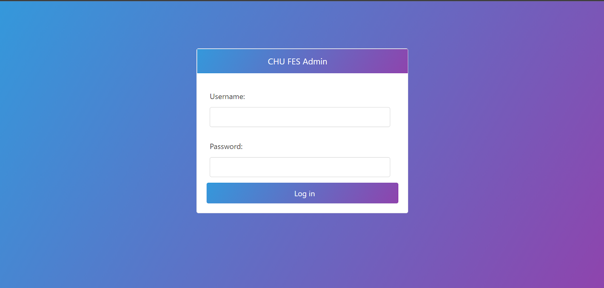

# Description
It's a a website where we can take a look at the state of our company's servers in real-time, I'm now working on the part frontend with ReactJS so that the page is refreshed automatically with the change of data.

# Main feautures
## Login

## Manuel Ping on one server

## Manuel Ping on multiple servers

## Automatic Ping every 1 minute 

## If Server failed an email is sent to the admin

## The Dashboard 
I am working on the dashboard to look great.

# I want to contribute to this projet
this project needed the part front end with react JS so that the dashboard is refreshed automaticaly when data is changed.

## Auto refresh of page with reactJS
